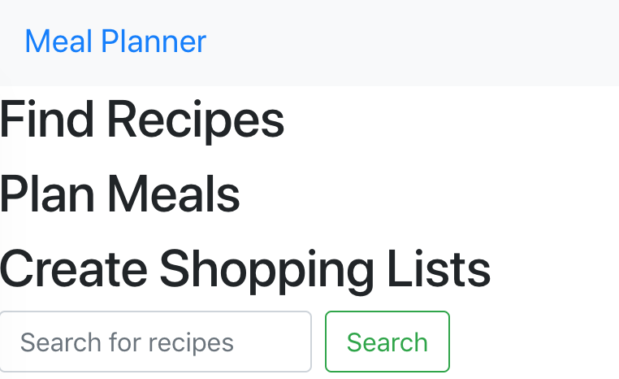

## Meal Planner

 
Meal Planner is a web application built using React. You can use it to search for recipes and create menus with shopping lists.

Live version of the web app can be accessed at: [https://jessgiehl.github.io/MealPlanner/](https://jessgiehl.github.io/MealPlanner/)

### Planned Features (not yet implemented)

* Seperate view for printing shopping lists
* Pagination for search results
* Chart for flavors

### `npm start`

Runs the application in the development mode. 
Open [http://localhost:3000](http://localhost:3000) to view it in the browser.
